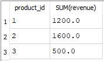
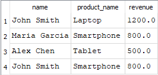

# Sales Data Analysis Using SQL

## Project Overview

This project demonstrates how SQL can be used to analyze business sales data stored in a relational database. A small database was created containing customer, product, and order information. SQL queries were then used to analyze revenue performance and customer purchasing behavior.

The purpose of this project is to demonstrate fundamental SQL analysis skills including database design, data aggregation, and relational joins.

---

## Database Structure

The database contains three tables that represent a simplified sales system.

### Customers Table

| customer_id | name | city |
|-------------|------|------|
| 1 | John Smith | New York |
| 2 | Maria Garcia | Miami |
| 3 | Alex Chen | San Francisco |

This table stores customer information.

---

### Products Table

| product_id | product_name | price |
|-------------|-------------|------|
| 1 | Laptop | 1200 |
| 2 | Smartphone | 800 |
| 3 | Tablet | 500 |

This table stores product details and pricing.

---

### Orders Table

| order_id | customer_id | product_id | revenue |
|----------|-------------|------------|---------|
| 1 | 1 | 1 | 1200 |
| 2 | 2 | 2 | 800 |
| 3 | 3 | 3 | 500 |
| 4 | 1 | 2 | 800 |

This table records transactions linking customers to the products they purchased.

---

## Query 1: Revenue by Product

### Business Question

Which products generate the most revenue?

### SQL Query

```sql
SELECT product_id, SUM(revenue)
FROM orders
GROUP BY product_id;
```

### Result



### Insight

The query aggregates total revenue by product. Product 2 generated the highest revenue in the dataset, followed by product 1 and product 3.

---

## Query 2: Customer Purchase Report

### Business Question

Which customers purchased which products?

### SQL Query

```sql
SELECT customers.name,
       products.product_name,
       orders.revenue
FROM orders
JOIN customers ON orders.customer_id = customers.customer_id
JOIN products ON orders.product_id = products.product_id;
```

### Result



### Insight

This query joins the orders, customers, and products tables to produce a transaction-level report showing which customers purchased each product and the revenue generated by each order.

---

## Tools Used

- SQL
- SQLite
- DB Browser for SQLite
- Visual Studio Code
- GitHub

---

## Skills Demonstrated

- Relational database design
- SQL aggregation using GROUP BY
- SQL joins
- Business data analysis

---

## Repository Contents

```
README.md
business_sales_analysis.db
customer_purchase_report.PNG
database_schema.sql
queries.sql
revenue_by_product.PNG
